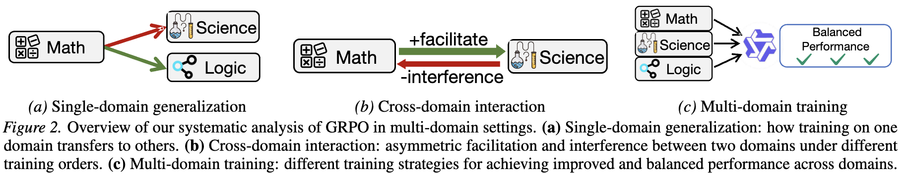

# cross_domain
 

## train model with verl
- data construction
    - please go to the directory: 
        - verl/examples/data_preprocess_mix_reward
- train
    - please go to the file: verl/examples/my_test/mix_reward/grpo_dapo_small.sh
    - there are 4 training datasets:
        - math_train_path
        - science_train_path
        - logic_train_path
        - puzzle_train_path

## verify model
- first test models on 4 datasets
    - go to the file: verify/test.py
- the results of our paper are in: 
    - verify/test.ipynb
    - verify/draw_curves.ipynb
- here are some results on our paper
    - 
